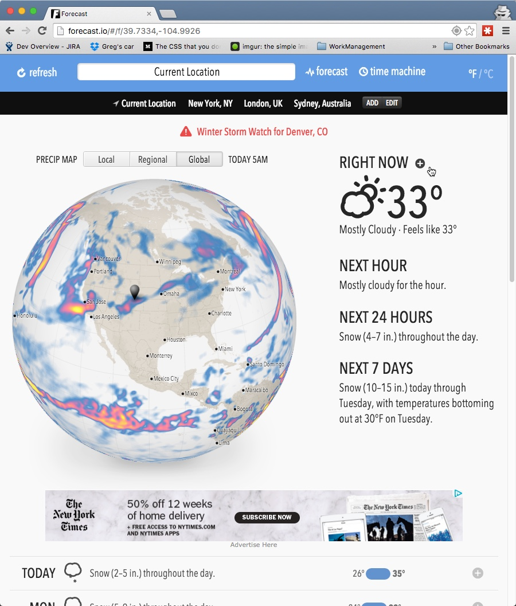
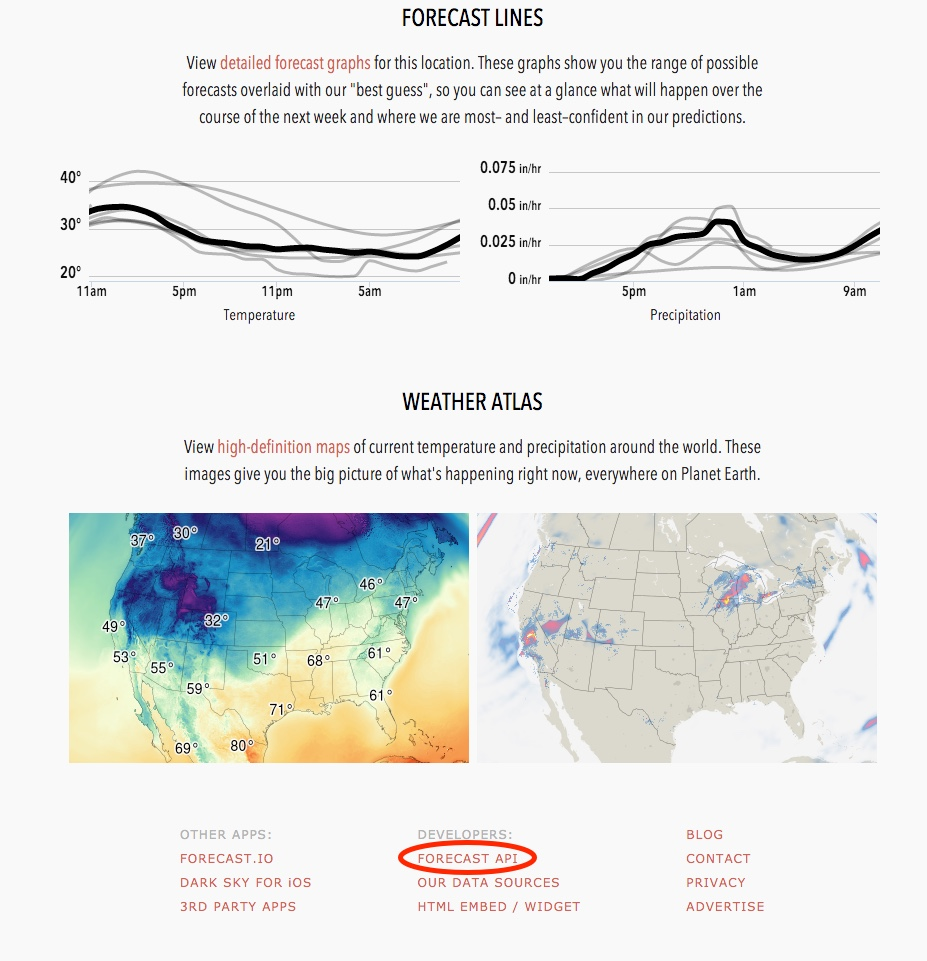
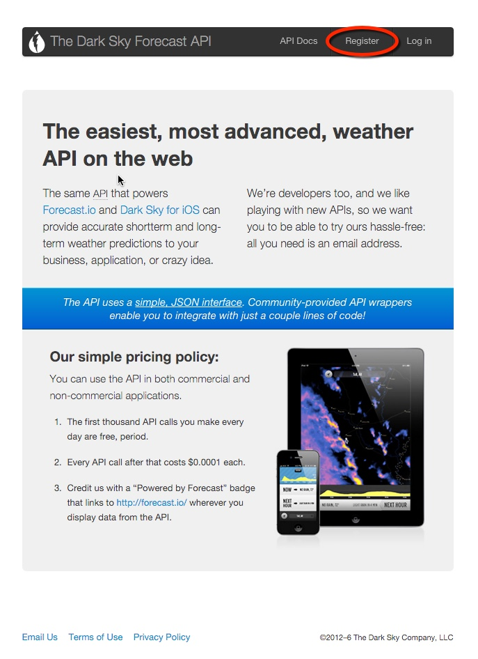
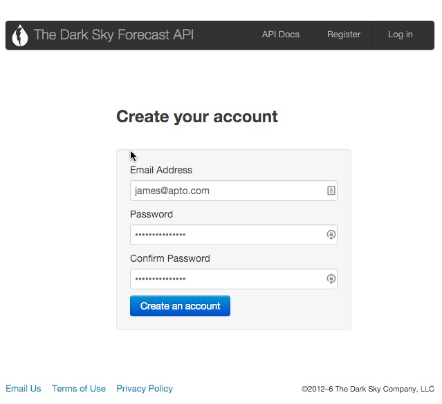
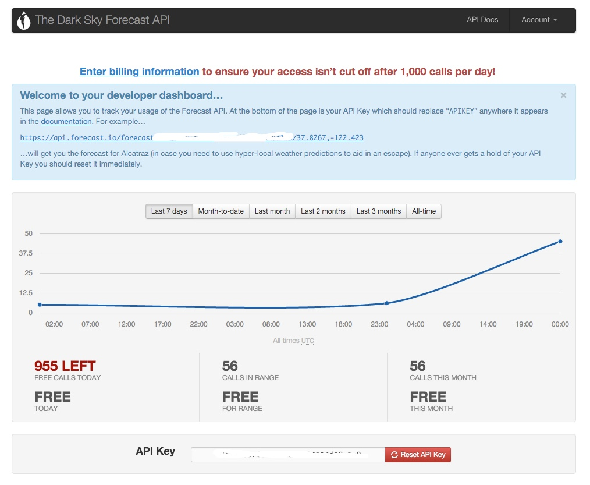

# Demystifying A Weather API

Ever wanted to build something that used someone else's data? Well many websites actually make their data available through Application Programming Interfaces or API's for short, sometimes for free!

During this meetup I'd like to introduce you to a few tips and tricks on how to gain access to API's for your own projects. We will be utilizing a popular weather forecast site to request an API key, using that key to interact with the API, and then stepping through some javascript to see the data in action.

#### Prerequsites

This guide assumes that you have Node.js installed on your computer, if you do not have it installed or have no idea what Node.js is check out this [tutorial](https://html5hive.org/complete-beginners-guide-to-node-js/)

#### Getting started

These days weather data seems to be everywhere, and in some regards it is everywhere.  I have chosen to introduce weather apis to you by focusing on a fairly unique product in the weather data market, Forecast.io.  This weather site aggregates through statistics multiple weather sources to provide hyper-local forecasts based on your location.

Have no fear, the service that they provide is actually free for low volume users like ourselves!

I'd like to walk you through obtaining an API key, making a call to the API, explaining a few pitfalls to avoid, as well as building a simple web page that will communicate with a simple web server to deliver personalized weather information.  The idea is that you will be able to change anything to your liking after the meetup :-)

#### Obtaining an API key

Many sites advertise their API's in the site footer, usually they mention API or Developer as part of the link.  If we scroll to the bottom of forecast.io we will see the following:

Go ahead and click on it, we will be taken to the developer portal for forecast.io.

Click register and fill in your information

Once logged in you will have access to the API key.

#### Doing something with the key
Once logged in you will see something similar to this:

If you click on the example link a weather forecast will open.  It will be a large JSON object, one that we will have to parse later.

Go ahead and open your browser (I am using chrome), and in a new tab open the JS console; In chrome this is under the developer tools.

Paste this function into the console and press enter:

    function httpGet(url, callback)
    {
        console.log(url);
        var xmlHttp = new XMLHttpRequest();
        xmlHttp.onreadystatechange = function() {
            if (xmlHttp.readyState == 4 && xmlHttp.status == 200)
                callback(JSON.parse(xmlHttp.responseText));
        }
        xmlHttp.open("GET", url, true); // true for asynchronous
        xmlHttp.send(null);
    }

Chrome will print `undefined` onto the console, this is fine.

Next enter the following into your console, remembering to replace the `<apiKey>` place holder with your api key, then press enter.

    httpGet('https://api.forecast.io/forecast/<apiKey>/37.8267,-122.423', function(result) { 
        console.log(result);
    });
    
Now this will respond with an error, chrome reports the error as:

    Fetch API cannot load https://api.forecast.io/forecast/<apiKey>/37.8267,-122.423. 
    No 'Access-Control-Allow-Origin' header is present on the requested resource. 
    Origin 'https://www.google.com' is therefore not allowed access. 
    If an opaque response serves your needs, set the request's mode to 'no-cors' to fetch the resource with CORS disabled.
    
####Don't Panic.

This error is actually the browser protecting you as the user from what is known as Cross Site Scripting or [XSS](https://en.wikipedia.org/wiki/Cross-site_scripting) for short.

To work around this we will actually utilize Node.js to set up a simple web server that will query forecast.io for the forecast and then send the data to a page we design.

#### Setting up the forecast app

We will be creating a few files to support our endeavor, so in an empty folder create the following:

* public/ `(new folder)`
    * index.html
    * main.js
    * styles.css

Download this [image](https://raw.githubusercontent.com/james-gibson/meetupDemystifyingWeatherAPI/master/public/Blur-1.png) and save in the public folder.

Open up the `index.html` file and paste the following in:

    <html>
    <head>
        <link rel="stylesheet" href="styles.css"/>
        
        <title>Personal Forecast</title>
    </head>
    <body>
        <header>
            <h1>Personal Forecast</h1>
            

        </header>
        <section>
            

                <h3>Current Temp</h3>
                <h3 class="temperature current">...</h3>
            

            

                <h3>Summary</h3>
                
...

            

            

                <h3>Current Humidity</h3>
                <h4 class="humidity current">...</h4>
            

        </section>
    </body>
    
    </html>

Open the `styles.css` file and paste the following:

    body {
        height: 100%;
        width: 100%;
        font-family: Helvetica, sans-serif;
        text-align: center;
        background-size: cover;
        background-image: url("Blur-1.png");
    }
    
    div {
        display: inline-block;
        width: 30%;
        min-width: 200px;
        margin: 20px;
        background-color: rgba(240, 240, 240, .4);
        border-radius: 20px;
        max-height: 200px;
        float:left;
    }
    
    h1 {
        margin-top: 30px;
        color: #183E5C;
        font-size: 36px;
    }
    
    div.inline {
        height: 100%;
        padding-top: 30px;
    }
    
    h3 {
        font-size: 26px;
        color: #28262C;
    }
    
    .current {
        color: slategrey;
    }
    
    .current .colloquial {
        width: 100%;
        word-wrap: break-word;
        overflow: hidden;
    }
    
    .humidity::after {
        content: "%";
    }
    
    .temperature::after {
        content: "°F";
    }
    
    h4 {
        font-size: 20px;
    }
    
Now open up the `main.js` file and lets get started:

A basic tennant of getting localized weather is to actually know your location.  Thankfully browsers can provide this information for us: [Mozilla Docs](https://developer.mozilla.org/en-US/docs/Web/API/Geolocation/Using_geolocation)

    (function location(){
        navigator.geolocation.getCurrentPosition(function(position) {
            console.log(position.coords.latitude, position.coords.longitude);
        });
    })();
    
Paste the above code into main.js at the top of the file.

Now below that function lets setup a function that can handle getting the forecast.

    function queryForecast(latitude,longitude) {
    
    }

Because we will be making a http request we will also need a function to handle setting up a xmlHttpRequest call for us.  Go ahead and add this function to `main.js`:

    function httpGet(url, callback)
    {
        console.log(url);
        var xmlHttp = new XMLHttpRequest();
        xmlHttp.onreadystatechange = function() {
            if (xmlHttp.readyState == 4 && xmlHttp.status == 200)
                callback(JSON.parse(xmlHttp.responseText));
        }
        xmlHttp.open("GET", url, true); // true for asynchronous
        xmlHttp.send(null);
    }
    
If that function looks familiar its because its the same function we pasted into our browsers earlier.  This function will make a http call and pass the results of that requests into the function `callback`.

Now that we have a function to call we will want to call it inside our geolocation function.  That function should now look like this:

    (function location(){
        navigator.geolocation.getCurrentPosition(function(position) {
            console.log(position.coords.latitude, position.coords.longitude);
    
            queryForecast(position.coords.latitude,position.coords.longitude);
        });
    })();
    
We will also need to update the html dom with the response created by our request (don't worry we havent created that yet).

Let's create a function to update the UI:

    function updateUI(weatherData) {

    }
Then call that function via our `httpGet` function:
    
    var apiUrl = 'http://localhost:3000/forecast?latitude=' + latitude + '&longitude=' + longitude;

    httpGet(apiUrl, updateUI);
    
At this point `main.js` should look like this:

    (function location(){
        navigator.geolocation.getCurrentPosition(function(position) {
            console.log(position.coords.latitude, position.coords.longitude);
    
            queryForecast(position.coords.latitude,position.coords.longitude);
        });
    })();
    
    function queryForecast(latitude,longitude) {
    
        var apiUrl = 'http://localhost:3000/forecast?latitude=' + latitude + '&longitude=' + longitude;
    
        httpGet(apiUrl, updateUI);
    
    
        function updateUI(weatherData) {
            
        }
    
        function httpGet(url, callback)
        {
            console.log(url);
            var xmlHttp = new XMLHttpRequest();
            xmlHttp.onreadystatechange = function() {
                if (xmlHttp.readyState == 4 && xmlHttp.status == 200)
                    callback(JSON.parse(xmlHttp.responseText));
            }
            xmlHttp.open("GET", url, true); // true for asynchronous
            xmlHttp.send(null);
        }
    }
    
#### Now for the Node.js webserver

Node is simply a javascript runtime for the server side, all it does is run your code.  It can be as lightweight as you like or as complex as you like.  Our usage will be quite simple.

In the root directory of your files, i.e.

* rootDir
	* public/
	    * index.html
   		* main.js
   		* styles.css
   		
Run `npm init` and accept all the defaults, this sets up your directory as a node application.

Then run `npm install --save express` and `npm install --save forecast.io`

[Express](http://expressjs.com/) is a web framework that will listen for http requests and then pass those requests into your logic.

[Forecast.io](https://www.npmjs.com/package/forecast.io) provides us with a nice wrapper around connecting to the forecast.io api.  To keep our code simple we will utilize it.

####Lets create our server

Create two new files called `app.js` and `weatherData.js` in  your root directory.

Paste the following into `app.js`:

    var express = require('express');
    var weatherData = require('./weatherData.js');
    var port = 3000;
    
    var app = express();
    
    app.use(express.static('public'));
    
    app.use('/forecast', weatherData);
    
    // catch 404 and forward to error handler
    app.use(function(req, res, next) {
        var err = new Error('Not Found');
        err.status = 404;
        next(err);
    });
    
    app.listen(port, function () {
        console.log('Personal Forecast app listening on port ' + port);
    });
    
 Now lets break down each part:
 
      var express = require('express'); //this imports the express library for us to use.
      
      var weatherData = require('./weatherData.js'); // this imports our app logic which we will create shortly
      
      var port = 3000; //the http requests traditionally use port 80 however to mitigate security issues during this we will use the node.js standard of 3000
      
      var app = express(); //Setup express
      
      app.use(express.static('public')); //this will serve up our html, css, and js as static files (very helpful)
      
      app.use('/forecast', weatherData); //This registers http://localhost:3000/forecast as an endpoint for us to use
      
      // catch 404 and forward to error handler
      app.use(function(req, res, next) {
          var err = new Error('Not Found');
          err.status = 404;
          next(err);
      });
      
      app.listen(port, function () {//this launches express and opens our defined port as ready for requests
          console.log('Personal Forecast app listening on port ' + port);
      });
      
      
 
 
### TODO: Document the following code:
 
    var Forecast = require('forecast.io');
    
    var options = {
        APIKey: 'f9432de5768255133e4634114d18a1c9',
        timeout: 1000
    };
    var forecast = new Forecast(options);
    
    function getForecast(req, res) {
        var latitude = req.query.lat || req.query.latitude;
        var longitude = req.query.lon || req.query.longitude;
        var time = req.query.time || new Date();
    
        if(!latitude || !longitude) {
            res.status = 400;
            var response = {};
            response.error = 'Whoops, we seem to have run into an issue';
            res.json(response);
            return;
        }
    
        var queryPromise = queryForecast(latitude, longitude);
    
        queryPromise.then(function(forecastResult) {
            res.json(forecastResult);
        })
    
        queryPromise.catch(function(reason) {
            var response = {};
            response.error = 'Whoops, we seem to have run into an issue';
            response.message = reason;
            res.json(response);
        });
    };
    
    function queryForecast(latitude, longitude) {
        var promise = new Promise(function(resolve,reject){
            forecast.get(latitude, longitude, function (err, res, data) {
                if (err) {
                    reject(err);
                };
    
                resolve(data);
            });
        });
    
    
        return promise;
    }
    
    module.exports = getForecast;
 